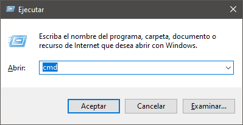

# *Breve Introducción a API de CSi y Autodesk.*

**Descripción**

Esta Aplicacion es el inicio, para aprender a reducir el tiempo de generación de un 
modelo, y ademas dá la ventaja de disminuir errores al momento de ingresar los 
datos mediante técnicas basicas de modelamiento. Te guiaremos paso a paso a 
configurar el entorno de desarrollo y te damos una ayuda para crear tus 
propias sincronizaciones con aplicacion con `ETABS`, `SAP2000`, `BRIDGE`, `SAFE` con `Python`, `C#` y `Octave o Matlab`.

## Requerimientos.
*	Capacitado en Programación y manejo de Programas de Ingeniería.
*	Computadora o laptop con suficiente capacidad
*	Plataforma Windows o Mac
*	Etabs 21, 19, 18 ,17 o en su versión más reciente.
*	Python 3.x, o en su versión más reciente.
*	Librería os, sys, PyQt6, pandas, openpyxl, y comtypes para Python.
*	Editor Visual Studio Code, Sublime text 3, PyCharm u otro.

## Introducción al Terminal.

### Terminal Windows – cmd/Windows PowerShell.

La cmd o consola de Windows es la equivalente a la terminal de Linux o la que proporcionan otros sistemas 
operativos como macOS. La aplicación se ejecuta en modo texto y no es tan intuitiva como una interfaz 
gráfica de usuario típica, pero sigue siendo una opción recomendable para usuarios avanzados o 
profesionales que requieran realizar tareas de forma más flexible y rápida. 

En sistemas Windows, la consola se denomina símbolo del sistema (Command prompt – CMD) y es la aplicación 
utilizada en sistemas basados en NT (Windows XP, Windows 7, Windows 8, Windows 10, Windows Server) 
para ejecutar comandos MS-DOS (.exe de 16 bits) y otros como scripts con formato .bat y .sys.

Windows PowerShell, es otra apliación que integra Windows, es una interfaz de consola con posibilidad de 
escritura y unión de comandos por medio de instrucciones. Esta interfaz de consola está diseñada para su uso 
por parte de administradores de sistemas, con el propósito de automatizar tareas o realizarlas de forma más controlada.

Windows Terminal, es una interfaz de línea de comandos con múltiples pestañas que Microsoft ha desarrollado 
para Windows, como reemplazo de la consola de Windows. Puede ejecutar cualquier aplicación de línea de 
comandos, incluidos todos los emuladores de terminal de Windows, en una pestaña separada. 

### Terminal de Mac – Terminal.
El Terminal es un emulador y funciona con comandos típicos de Unix (`OS X` tiene su base en `Unix` en lugar de 
`Windows` que tiene su base en `NT`). En contradicción de `OS X`, que tiene un GUI, el Terminal tiene una 
interfaz basada en texto y todos los comandos se tiene que entrar.

## Ejecutar aplicaciones con la terminal.
Para poder ejecutar una aplicación se puede usar la terminal, tanto en `OS X` como en `Windows`, `Linux` o en otra 
plataforma, por lo que será importante este paso para poder entender como ejecutar una aplicación ejecutable.

#### Windows.
Ahora una aplicación se puede ejecutar desde la ruta donde se instaló la aplicación, o desde la parte global, 
pero esto siempre que este agregado el Path (ruta), poniendo solo el nombre de la aplicación.

`Windows+R`, para ejecutar cualquier aplicación como el siguiente.


Figura 1.0.

Una ves ejecutado la terminal (`cmd`), uno puede ir dirigiéndose a directorios y ejecutar aplicaciones o 
abrir archivos como se puede apreciar en la siguiente figura.


Figura 1.1.

Entonces, como indicamos que podemos ejecutar aplicación, en nuestro caso podriamos ejecutaremos Etabs, 
y por su puesto que podemos ponemos las instrucciones para ejecutar Python y Visual Studio Code.

|Aplicación	|Ejemplo de Ruta|
|-----------|----|
|`Etabs`	|C:\\Program Files\\Computers and Structures\\ETABS 19\\ETABS.exe
|…|…
|`Python`	|C:\Python39\python.exe
|`Visual Studio Code`	|C:\Users\UserName\AppData\Local\Programs\Microsoft VS Code\Code.exe
Tabla 1.2.

El siguiente grafico se muestra la ejecución de Etabs, para las demás aplicaciones funciona de la misma forma.

  
Figura 1.3.

  
Figura 1.4.

Entonces este concepto de ir recorriendo de un directorio a otro, crear, eliminar, y a la ves ejecutar 
aplicaciones y scripts. Entonces, ¿De que modo afecta en nuestro estudio y propósito?, pues la 
respuesta es que, justamente vamos a necesitar este concepto, para poder ejecutar comandos `python`
y a la vez poder ejecutar `Etabs/Python` y a la vez poder conectarnos con `Etabs`, y poder mandar
comandos para interactuar con las funciones a modelo de `Etbas`

#### Mac os.
Pasos a ejecutar en una Mac.

## Descripción a las aplicaciones.

### Etabs.
ETABS es un software innovador y revolucionario para análisis estructural y dimensionamiento de edificios. ETABS tiene la capacidad de cubrir todos los pasos para el modelamiento, creación y generación de detalles de una estructura.

Desde el modelado de la estructura a la creación de diseños y detalles, ETABS cubre todos los pasos del proceso de dimensionamiento. Los comandos de diseño son intuitivos y permiten la rápida generación de plantas y alzados estructurales. Diseños CAD pueden convertirse directamente en modelos ETABS o usarse como plantillas a partir de los cuales se puede realizar el modelado.

`Nota`: más información en ETABS.

#### CSI API ETABS v1.
API (Application Programming Interface) permite a los ingenieros y programadores comprobar la eficacia de los productos CSI. A través de conocimientos básicos de programación, es posible crear pre y pos procesadores para diferentes aplicaciones, plugins, u otras herramientas que permiten conectar con el software CSI. API es compatible con la mayoría de los lenguajes de programación, incluyendo `Visual Basic para Aplicaciones (VBA)`, `VB.NET`, `C#`, `C++`, `Visual Fortran`, `Python` y `Matlab`.

API de CSI está actualmente disponible para SAP2000, ETABS y CSiBridge.
Se ha desarrollado para ser lo más consistente posible entre los varios productos de CSI, permitiendo que cualquier herramienta y/o aplicación se adapte fácilmente entre productos.

`Nota`: más información en CSI API ETABS v1.

### Visual Studio Code.
Es un editor de código abierto desarrollado por Microsoft para plataformas Windows, Linux y macOS. Incluye soporte para depuración, control de Git integrado, resaltado de sintaxis, finalización de código inteligente, fragmentos de código y refactorización de código.

### Python.
Python es un lenguaje de programación interpretado cuya filosofía hace hincapié en la legibilidad de su código. Se trata de un lenguaje de programación multiparadigma, ya que soporta parcialmente la orientación a objetos, programación imperativa y, en menor medida, programación funcional.

`Nota`: más información en Python.

#### Librería os.
La documentación de Python para el módulo os se subtitula «Interfaces diversas del sistema operativo». El módulo consta principalmente de funciones para crear y administrar procesos en ejecución o contenido del sistema de archivos (archivos y directorios), además de algunas otras funcionalidades.

`Nota`: más información en Python os.

#### librería sys.
Una cadena de caracteres que proporciona la ruta absoluta del binario ejecutable para el intérprete de Python, en sistemas donde esto tiene sentido. Si Python no puede recuperar la ruta real a su ejecutable, sys. executable será una cadena de caracteres vacía o None.

`Nota`: más información en Python sys.

#### Librerías pandas.
pandas es un paquete de Python que proporciona estructuras de datos similares a los dataframes de R. Pandas depende de Numpy, la librería que añade un potente tipo matricial a Python. Datos tabulares con columnas de tipo heterogéneo con etiquetas en columnas y filas.

`Nota`: más información en Pandas.

#### Librería PyQt6.
PyQt es un binding de la biblioteca gráfica Qt para el lenguaje de programación Python. La biblioteca está desarrollada por la firma británica Riverbank Computing y está disponible para Windows, GNU/Linux y Mac OS X bajo diferentes licencias.

`Nota`: más información en PyQt6.

#### Librería openpyxl.
Es un módulo de Python que permite leer, crear y modificar ficheros Excel. 

`Nota`: más información en Openpyxl.

#### Librerias Comtype.
comtypes es un paquete `COM` de Python puro basado en la biblioteca de funciones externa `ctypes ffi`. El paquete comtypes facilita el acceso e implementación de interfaces `COM` personalizadas y basadas en envíos.

`Nota`: más información en Comtypes.


## referecias.
	
* [CSI ETBAS](https://www.csiamerica.com/products/etabs/enhancements)
<!-- * [CSI](https://www.csiespana.com/) -->
* [Python](https://www.python.org/)


crear o generar codigo_python (*.py) de ui_qtDesigner (*.ui)
````bash
> pyuic6 -x nombreArchivo.ui -o nombreArchivo.py
````