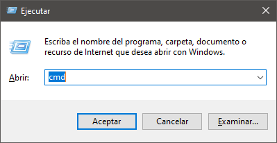
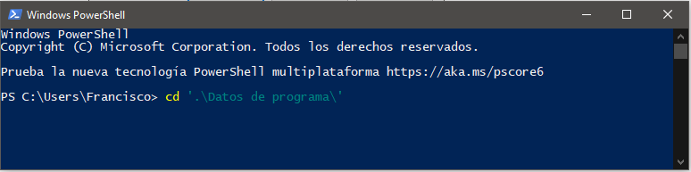
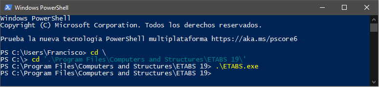

*Breve Introducción a Etabs API con Python.*
============================================

**Descripción**

Esta Aplicacion es el inicio para, aprender a reducir el tiempo de
generación de un modelo, y ademas dá la ventaja de disminuir errores al
momento de ingresar los datos mediante técnicas basicas de modelamiento.
Te guiaremos paso a paso a configurar el entorno de desarrollo y te
damos una ayuda para crear tus propias sincronizaciones con aplicacion
con ``ETABS``, ``SAP2000`` y ``Python``.

Requerimientos.
---------------

-  Persona Capacitado en Programación y manejo de Programas de
   Ingeniería.
-  Computadora o laptop con suficiente capacidad
-  Plataforma Windows o Mac
-  Etabs 19,18,17,16 o en su versión más reciente.
-  Python 3.x, o en su versión más reciente.
-  Librería os, sys, PyQt6, pandas, openpyxl, y comtypes para Python.
-  Editor Visual Studio Code, Sublime text 3, PyCharm u otro.

Introducción al Terminal.
-------------------------

Terminal Windows – cmd/Windows PowerShell.
~~~~~~~~~~~~~~~~~~~~~~~~~~~~~~~~~~~~~~~~~~

La cmd o consola de Windows es la equivalente a la terminal de Linux o
la que proporcionan otros sistemas operativos como macOS. La aplicación
se ejecuta en modo texto y no es tan intuitiva como una interfaz gráfica
de usuario típica, pero sigue siendo una opción recomendable para
usuarios avanzados o profesionales que requieran realizar tareas de
forma más flexible y rápida.

En sistemas Windows, la consola se denomina símbolo del sistema (Command
prompt – CMD) y es la aplicación utilizada en sistemas basados en NT
(Windows XP, Windows 7, Windows 8, Windows 10, Windows Server) para
ejecutar comandos MS-DOS (.exe de 16 bits) y otros como scripts con
formato .bat y .sys.

Windows PowerShell, es otra paliación que integra Windows 10, es una
interfaz de consola con posibilidad de escritura y unión de comandos por
medio de instrucciones. Esta interfaz de consola está diseñada para su
uso por parte de administradores de sistemas, con el propósito de
automatizar tareas o realizarlas de forma más controlada.

Windows Terminal, es una interfaz de línea de comandos con múltiples
pestañas que Microsoft ha desarrollado para Windows 10, como reemplazo
de la consola de Windows. Puede ejecutar cualquier aplicación de línea
de comandos, incluidos todos los emuladores de terminal de Windows, en
una pestaña separada.

Terminal de Mac – Terminal.
~~~~~~~~~~~~~~~~~~~~~~~~~~~

El Terminal es un emulador y funciona con comandos típicos de Unix
(``OS X`` tiene su base en ``Unix`` en lugar de ``Windows`` que tiene su
base en ``NT``). En contradicción de ``OS X``, que tiene un GUI, el
Terminal tiene una interfaz basada en texto y todos los comandos se
tiene que entrar.

Ejecutar aplicaciones con la terminal.
--------------------------------------

Para poder ejecutar una aplicación se puede usar la terminal, tanto en
``OS X`` como en ``Windows``, ``Linux`` o en otra plataforma, por lo que
será importante este paso para poder entender como ejecutar una
aplicación ejecutable.

Windows.
^^^^^^^^

Ahora una aplicación se puede ejecutar desde la ruta donde se instaló la
aplicación, o desde la parte global, pero esto siempre que este agregado
el Path (ruta), poniendo solo el nombre de la aplicación.

``Windows+R``, para ejecutar cualquier aplicación como el siguiente.

|windows| Figura 1.0.

Una ves ejecutado la terminal (``cmd``), uno puede ir dirigiéndose a
directorios y ejecutar aplicaciones o abrir archivos como se puede
apreciar en la siguiente figura.

|image1| Figura 1.1.

Entonces, como indicamos que podemos ejecutar aplicación, en nuestro
caso podriamos ejecutaremos Etabs, y por su puesto que podemos ponemos
las instrucciones para ejecutar Python y Visual Studio Code.

+---------------------------------------------------+------------------+
| Aplicación                                        | Ejemplo de Ruta  |
+===================================================+==================+
| ``Etabs``                                         | C::raw-l         |
|                                                   | atex:`\Program ` |
|                                                   | Files:raw-latex: |
|                                                   | `\Computers `and |
|                                                   | Structu          |
|                                                   | res:raw-latex:`\ |
|                                                   | ETABS 19`:raw-la |
|                                                   | tex:`\ETABS`.exe |
+---------------------------------------------------+------------------+
| …                                                 | …                |
+---------------------------------------------------+------------------+
| ``Python``                                        | C::raw-latex:`\P |
|                                                   | ython39`:raw-lat |
|                                                   | ex:`\python`.exe |
+---------------------------------------------------+------------------+
| ``Visual Studio Code``                            | C::              |
|                                                   | raw-latex:`\User |
|                                                   | s`:raw-latex:`\U |
|                                                   | serName`:raw-lat |
|                                                   | ex:`\AppData`:ra |
|                                                   | w-latex:`\Local` |
|                                                   | :raw-latex:`\Pro |
|                                                   | grams`:raw-latex |
|                                                   | :`\Microsoft `VS |
|                                                   | Code:raw-l       |
|                                                   | atex:`\Code`.exe |
+---------------------------------------------------+------------------+

Tabla 1.2.

El siguiente grafico se muestra la ejecución de Etabs, para las demás
aplicaciones funciona de la misma forma.

|image2| Figura 1.3.

|image3| Figura 1.4.

Entonces este concepto de ir recorriendo de un directorio a otro, crear,
eliminar, y a la ves ejecutar aplicaciones y scripts. Entonces, ¿De que
modo afecta en nuestro estudio y propósito?, pues la respuesta es que,
justamente vamos a necesitar este concepto, para poder ejecutar comandos
``python`` y a la vez poder ejecutar ``Etabs/Python`` y a la vez poder
conectarnos con ``Etabs``, y poder mandar comandos para interactuar con
las funciones a modelo de ``Etbas``

Mac os.
^^^^^^^

Pasos a ejecutar en una Mac.

Descripción a las aplicaciones.
-------------------------------

Etabs.
~~~~~~

ETABS es un software innovador y revolucionario para análisis
estructural y dimensionamiento de edificios. ETABS tiene la capacidad de
cubrir todos los pasos para el modelamiento, creación y generación de
detalles de una estructura.

Desde el modelado de la estructura a la creación de diseños y detalles,
ETABS cubre todos los pasos del proceso de dimensionamiento. Los
comandos de diseño son intuitivos y permiten la rápida generación de
plantas y alzados estructurales. Diseños CAD pueden convertirse
directamente en modelos ETABS o usarse como plantillas a partir de los
cuales se puede realizar el modelado.

``Nota``: más información en ETABS.

CSI API ETABS v1.
^^^^^^^^^^^^^^^^^

API (Application Programming Interface) permite a los ingenieros y
programadores comprobar la eficacia de los productos CSI. A través de
conocimientos básicos de programación, es posible crear pre y pos
procesadores para diferentes aplicaciones, plugins, u otras herramientas
que permiten conectar con el software CSI. API es compatible con la
mayoría de los lenguajes de programación, incluyendo
``Visual Basic para Aplicaciones (VBA)``, ``VB.NET``, ``C#``, ``C++``,
``Visual Fortran``, ``Python`` y ``Matlab``.

API de CSI está actualmente disponible para SAP2000, ETABS y CSiBridge.
Se ha desarrollado para ser lo más consistente posible entre los varios
productos de CSI, permitiendo que cualquier herramienta y/o aplicación
se adapte fácilmente entre productos.

``Nota``: más información en CSI API ETABS v1.

Visual Studio Code.
~~~~~~~~~~~~~~~~~~~

Es un editor de código fuente desarrollado por Microsoft para Windows,
Linux y macOS. Incluye soporte para depuración, control de Git
integrado, resaltado de sintaxis, finalización de código inteligente,
fragmentos de código y refactorización de código. Es gratuito y de
código abierto.

``Nota``: más información en vscode.

Python.
~~~~~~~

Python es un lenguaje de programación interpretado cuya filosofía hace
hincapié en la legibilidad de su código. Se trata de un lenguaje de
programación multiparadigma, ya que soporta parcialmente la orientación
a objetos, programación imperativa y, en menor medida, programación
funcional.

``Nota``: más información en Python.

Librería os.
^^^^^^^^^^^^

La documentación de Python para el módulo os se subtitula «Interfaces
diversas del sistema operativo». El módulo consta principalmente de
funciones para crear y administrar procesos en ejecución o contenido del
sistema de archivos (archivos y directorios), además de algunas otras
funcionalidades.

``Nota``: más información en Python os.

librería sys.
^^^^^^^^^^^^^

Una cadena de caracteres que proporciona la ruta absoluta del binario
ejecutable para el intérprete de Python, en sistemas donde esto tiene
sentido. Si Python no puede recuperar la ruta real a su ejecutable, sys.
executable será una cadena de caracteres vacía o None.

``Nota``: más información en Python sys.

Librerías pandas.
^^^^^^^^^^^^^^^^^

pandas es un paquete de Python que proporciona estructuras de datos
similares a los dataframes de R. Pandas depende de Numpy, la librería
que añade un potente tipo matricial a Python. Datos tabulares con
columnas de tipo heterogéneo con etiquetas en columnas y filas.

``Nota``: más información en Pandas.

Librería PyQt6.
^^^^^^^^^^^^^^^

PyQt es un binding de la biblioteca gráfica Qt para el lenguaje de
programación Python. La biblioteca está desarrollada por la firma
británica Riverbank Computing y está disponible para Windows, GNU/Linux
y Mac OS X bajo diferentes licencias.

``Nota``: más información en PyQt6.

Librería openpyxl.
^^^^^^^^^^^^^^^^^^

Es un módulo de Python que permite leer, crear y modificar ficheros
Excel.

``Nota``: más información en Openpyxl.

Librerias Comtype.
^^^^^^^^^^^^^^^^^^

comtypes es un paquete ``COM`` de Python puro basado en la biblioteca de
funciones externa ``ctypes ffi``. El paquete comtypes facilita el acceso
e implementación de interfaces ``COM`` personalizadas y basadas en
envíos.

``Nota``: más información en Comtypes.

referecias.
-----------

-  `CSI
   ETBAS <https://www.csiamerica.com/products/etabs/enhancements>`__
-  `CSI <https://www.csiespana.com/>`__
-  `Python <https://www.python.org/>`__

crear o generar codigo_python (*.py) de ui_qtDesigner (*.ui)

.. code:: bash

   > pyuic6 -x nombreArchivo.ui -o nombreArchivo.py

