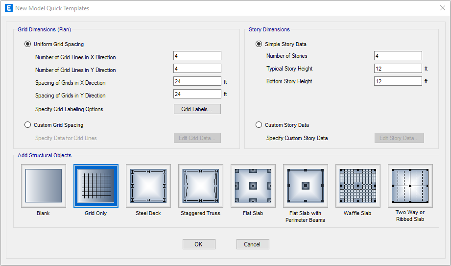
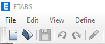
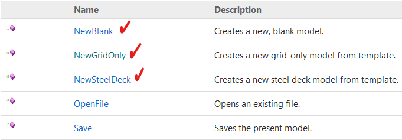
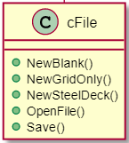

## Ampliando el uso de la Librería Comtype.
El paquete `comtypes` facilita el acceso e implementación de interfaces `COM` personalizadas y basadas en envíos.

El paquete `comtypes.client` implementa las funcionalidad de alto nivel de `comtipos`.

### Creación y acceso a objetos COM
`comtypes.client` expone tres funciones que permiten crear o tener acceso a objetos `COM`.

**`CreateObject(progid, clsctx=None, machine=None, interface=None, dynamic=False, pServerInfo=None)`**
Cree un objeto `COM` y devuelvale un puntero de interfaz.

- _`progid`_, especifica qué objeto crear. Puede ser una cadena, una instancia o cualquier objeto con un atributo que debe ser una instancia o una cadena GUID. `"InternetExplorer.Application" "{2F7860A2-1473-4D75-827D-6C4E27600CAC}" comtypes.GUID_clsid_comtypes.GUID`

- _`clsctx`_, especifica cómo crear el objeto, cualquier combinación de las constantes se puede utilizar. Si no pasa nada, se usa. `comtypes.CLSCTX_...comtypes.CLSCTX_SERVER`
- _`machine`_, permite especificar que el objeto debe crearse en un equipo diferente, debe ser una cadena que especifique el nombre del equipo o la dirección `IP`. `DCOM` debe estar habilitado para que esto funcione.
- _`interface`_, especifica la clase de interfaz que se debe devolver, si no se especifican __comtypes__ determinará una interfaz útil en sí y devolverá un puntero a eso.
- _`dynamic`_, especifica que la interfaz generada debe usar el envío dinámico. Esto solo está disponible para interfaces de automatización y no genera `typelib wrapper`(evoltorio de tipo de lireria).
- _`pServerInfo`_, que le permite especificar más información sobre el equipo remoto que el parámetro. Es un puntero a un archivo. y puede que no se suministre simultáneamente. `DCOM` debe estar habilitado para que esto funcione.`machine COSERVERINFO machine pServerInfo`

**`CoGetObject(displayname, interface=None)`**
Cree un objeto `COM` con nombre y devuelva un puntero de interfaz.

```python
# ejemplo 
wmi = CoGetObject("winmgmts:")
```

`interface` y tienen el mismo significado que en la función.`dynamicCreateObject`

**`GetActiveObject(progid, interface=None)`**
Devuelve un puntero a un objeto que ya se está ejecutando. especifica el objeto activo de la base de datos de registro OLE.`progid`

La función se realiza correctamente cuando el objeto `COM` ya se está ejecutando y se ha registrado en la tabla de objetos en ejecución `COM`. No todos los objetos `COM` hacen esto. Los argumentos son los descritos en `.GetActiveObjectCreateObject`

Las tres funciones mencionadas anteriormente crearán el contenedor de tipo de libreria (typelib) automáticamente si el objeto proporciona información de tipo. Si el objeto en sí no expone la biblioteca de tipos, el contenedor se puede crear llamando a la función. `GetModule`
### Calling methods - Usando objetos COM.

### Calling methods - Llamando a metodos.

### Accessing properties - accediendo a propiedades.

### Properties with arguments (named properties) - Propiedades con argumentos(propiedades nombradas).

### Properties with optional arguments - propiedades con argumentos opcionales.

## NumPy interop - interoperatividad con la libreria Numpy.

### NumPy Arrays as Input Arguments - Arrays en `Numpy` como entrada de argumentos.
En la tabla siguiente se muestran las conversiones de tipos que se pueden realizar rápidamente mediante () la conversión directa de una array/matriz `numpy` a SAFEARRAY.

|NumPy type	|VARIANT type|
|-----------|------------|
|int8	|VT_I1
|int16, short	|VT_I2
|int32, int, intc, int_	|VT_I4
|int64, long, longlong, intp	|VT_I8
|uint8, ubyte	|VT_UI1
|uint16, ushort	|VT_UI2
|uint32, uint, uintc	|VT_UI4
|uint64, ulonglong, uintp	|VT_UI8
|float32	|VT_R4
|float64, float_	|VT_R8
|datetime64	|VT_DATE
...

## Interacción(conexión) Python(\*.py, \*.pyw, ...) y Etabs (\*.edb), SAP2000 (\*.sdb).
Lo primero que tenemos que hacer es conectarnos con Etbas a través de Python con su librería Comtype.client

### Conexion Python a Etabs.

````py
# eb01EtabsAPI.py, algoritmo para la conexion.
import comtypes.client
import sys

try:
    # Connecting | coneccion para etabs
    ETABSObject = comtypes.client.GetActiveObject("CSI.ETABS.API.ETABSObject")
    # Connecting | coneccion para SAP2000
    # mySapObject = comtypes.client.GetActiveObject("CSI.SAP2000.API.SapObject")
    print("Conexion exitosa!.")
except (OSError, comtypes.COMError):
    # No running instance of the program found or failed to attach.
    print("No se encontró ninguna instancia en ejecución del programa(Etabs).")
    sys.exit(-1)
````
> comtypes.client.GetActiveObject("CSI.ETABS.API.ETABSObject").

descripcion ...

> OSError.

descripcion ...

> comtypes.COMError.

descripcion ...

### Creacion de un nuevo modelo Etabs con Python.
metodos de la clase `cFile`


Figura 1.9.

|ETABS | ETABS API v1 | comtypes.cliente `.SapModel.File` |
|------|--------------|-----------------|
| <br/><br/> <br/>Figura 1.9a| <br/>Figura 1.9b|.NewBlank() <br/>.NewGridOnly() <br/>.NewSteelDeck() <br/>.New2DFrame() <br/>.New2DFrame() <br/>.New3DFrame() <br/>.NewBeam() <br/>.NewSolidBlock() ...|
Tabla Nro. n.n

Representacion UML

  
Figura 1.9.

## `SapModel.File.New*`| Metodos para crear Nuevo Modelo
````py
# FORMAS DE INICIALIZAR UN MODELO 
# create new blank model | crea una nueva hoja en blanco
# resUnit = SapModel.File.NewBlank()

# create grid-only template model | Crea grilla
resUnit = SapModel.File.NewGridOnly(4,12,12,4,4,24,24)

# create steel deck template model | 
# resUnit = SapModel.File.NewSteelDeck(4,12.0,12.0,4,4,24.0,24.0)
````
## `saveFile` | Metodo GuardarArchvio.

````py
# saveFile()

#full path to the model, set it to the desired path of your model
APIPath = 'C:\\CSi_ETABS_API_Example'
if not os.path.exists(APIPath):
    try:
        os.makedirs(APIPath) #| intenta crear un directorio.
    except OSError:
        print("Error: "+OSError) #| si no se tiene permiso laza un error.
ModelPath = APIPath + os.sep + 'exampleAPI_1-001.edb'
# ModelPath = APIPath + os.sep + 'exAPI_1-002.edb'
# 'save file  | guardar archivo
# System.IO.Directory.CreateDirectory("c:\CSI_API_temp")
# resUnit = SapModel.File.Save("C:\CSI_API_temp\example.edb")
resUnit = SapModel.File.Save(ModelPath)
````
## `openFile` | Metodo AbrirAchivo

````py
# openFile()
# 'open an existing file - If no file exists, run the Save example first.
try:
	fileName = APIPath = 'C:\\CSi_ETABS_API_Example\\exAPI_1-002.edb'
except (OSError, comtypes.COMError):
    print(f"No se puede abrir {comtypes.COMError}")
    sys.exit(-1)
resUnit = SapModel.File.OpenFile(fileName)
````


