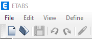

## Ampliando el uso de la Librería Comtype.
Breve descripción …

…
|NumPy type	|VARIANT type|
|-----------|------------|
|int8	|VT_I1
|int16, short	|VT_I2
|int32, int, intc, int_	|VT_I4
|int64, long, longlong, intp	|VT_I8
|uint8, ubyte	|VT_UI1
|uint16, ushort	|VT_UI2
|uint32, uint, uintc	|VT_UI4
|uint64, ulonglong, uintp	|VT_UI8
|float32	|VT_R4
|float64, float_	|VT_R8
|datetime64	|VT_DATE
...

## Interacción(conexión) Python(.py, .pyw, ...) y Etabs(.edb).
Lo primero que tenemos que hacer es conectarnos con Etbas a través de Python con su librería Comtype.client

### Conexion Python a Etabs.

````py
# eb01EtabsAPI.py, algoritmo para la conexion.
try:
    # Connecting | coneccion
    ETABSObject = comtypes.client.GetActiveObject("CSI.ETABS.API.ETABSObject")
    print("Conexion exitosa!.")
except (OSError, comtypes.COMError):
    # No running instance of the program found or failed to attach.
    print("No se encontró ninguna instancia en ejecución del programa(Etabs).")
    sys.exit(-1)
````
> comtypes.client.GetActiveObject("CSI.ETABS.API.ETABSObject").

descripcion ...

> OSError.

descripcion ...

> comtypes.COMError.

descripcion ...

### Creacion de un nuevo modelo Etabs con Python.
metodos de la clase `cFile`


Figura 1.9.

|ETABS | ETABS API v1 | comtypes.cliente `.SapModel.File` |
|------|--------------|-----------------|
| Figura 1.9.| Figura 1.9.|.NewBlank() .NewGridOnly() .NewSteelDeck() .New2DFrame() .New2DFrame() .New3DFrame() .NewBeam() .NewSolidBlock() ...|
Tabla n° nn


Figura 1.9.

Representacion UML

 
Figura 1.9.

## `SapModel.File.New*`| Metodos para crear Nuevo Modelo
````py
# FORMAS DE INICIALIZAR UN MODELO 
# create new blank model | crea una nueva hoja en blanco
# resUnit = SapModel.File.NewBlank()

# create grid-only template model | Crea grilla
resUnit = SapModel.File.NewGridOnly(4,12,12,4,4,24,24)

# create steel deck template model | 
# resUnit = SapModel.File.NewSteelDeck(4,12.0,12.0,4,4,24.0,24.0)
````
## `saveFile` | Metodo GuardarArchvio.

````py
# saveFile()

#full path to the model, set it to the desired path of your model
APIPath = 'C:\\CSi_ETABS_API_Example'
if not os.path.exists(APIPath):
    try:
        os.makedirs(APIPath) #| intenta crear un directorio.
    except OSError:
        print("Error: "+OSError) #| si no se tiene permiso laza un error.
ModelPath = APIPath + os.sep + 'exampleAPI_1-001.edb'
# ModelPath = APIPath + os.sep + 'exAPI_1-002.edb'
# 'save file  | guardar archivo
# System.IO.Directory.CreateDirectory("c:\CSI_API_temp")
# resUnit = SapModel.File.Save("C:\CSI_API_temp\example.edb")
resUnit = SapModel.File.Save(ModelPath)
````
## `openFile` | Metodo AbrirAchivo

````py
# openFile()
# 'open an existing file - If no file exists, run the Save example first.
try:
	fileName = APIPath = 'C:\\CSi_ETABS_API_Example\\exAPI_1-002.edb'
except (OSError, comtypes.COMError):
    print(f"No se puede abrir {comtypes.COMError}")
    sys.exit(-1)
resUnit = SapModel.File.OpenFile(fileName)
````


